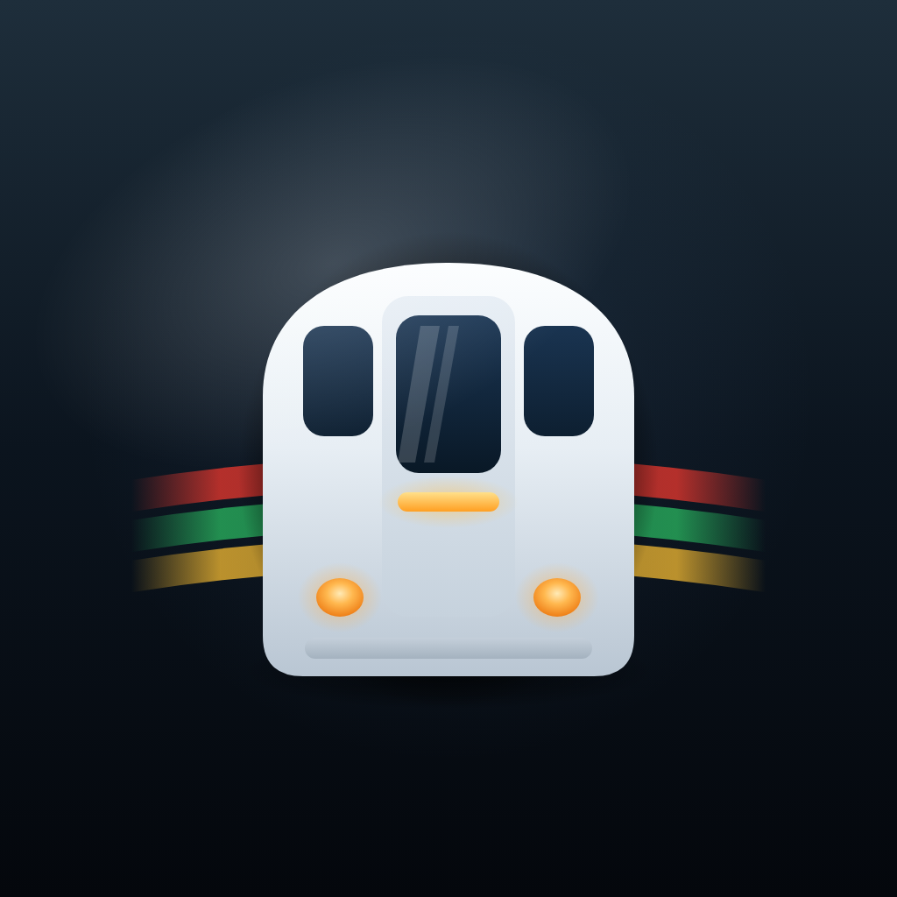
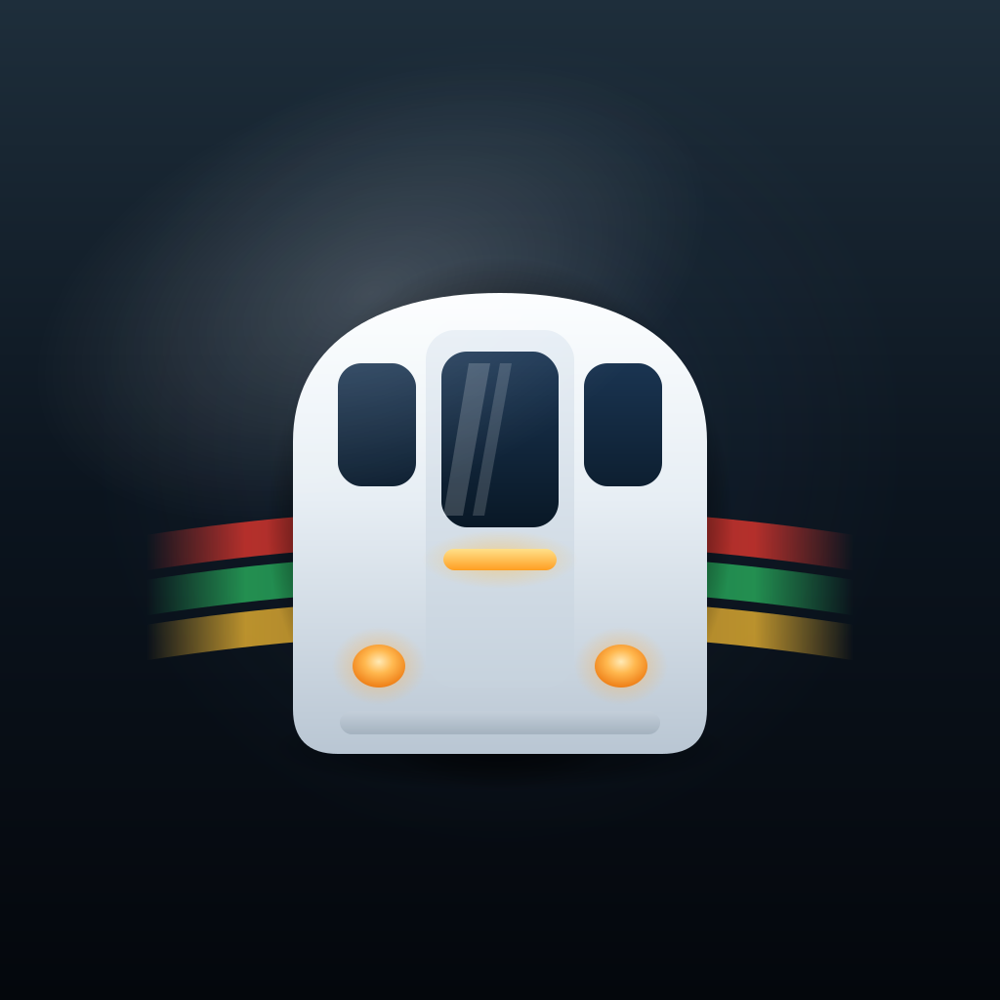

# TubeBoard — App Icon ("Minimal Tube Glass v2")

Production app-icon source for **TubeBoard**, a London Underground live-train-times
app. The icon communicates *Tube train · live arrivals · movement · trust* with a
single, calm, Apple-native symbol. It deliberately avoids TfL's roundel, station
signage, official marks, text, letters and numbers.



---

## 1. Concept summary

A **graphite-navy glass** field (deep, "underground", graphite → near-black) with a
simplified **front-facing Tube train** in the centre. Behind it, three **translucent
tube-line ribbons** (red / green / amber) sweep outward to suggest live movement and
the Tube map — without ever drawing a line diagram or roundel, and deliberately *not*
a rainbow. The train follows the classic **London Tube front**: a **pale glass body
with a domed/tapered roof**, a **tall central cab-door window** (with a clean double
glass glint) flanked by **two side windows tucked under the curved shoulders**, an
abstract **amber "arrivals" strip** on the cab door, and **two round headlamps set
wide and low** above a subtle bumper seam. A soft **shadow halo** lifts the train off
the ribbons.

Visual ideas kept to ~four: **glass background · colour-ribbon movement · the train ·
layered depth.** The silhouette alone reads as a Tube train, so the icon survives mono,
tint and small sizes (see §6–§7).

### Concept directions explored (chosen one in **bold**)

| # | Direction | Why / why not |
|---|-----------|---------------|
| A | **Minimal Tube Glass** — front-facing train + translucent line trails on navy glass | **Chosen.** Strongest silhouette, clearly a Tube train, calm and premium, excellent mono/small-size legibility. |
| B | Capsule + signal dot — abstract train capsule with a single pulsing "live arrival" dot | Cleaner still, but reads as a generic pill/medicine or capsule, loses the "train" signal. |
| C | Roundel-of-rails — concentric translucent arcs forming a circular motif behind a window | Too close to the TfL roundel; risks looking like an official transport-authority mark. Rejected on brief. |

Direction A wins because the **train front is unmistakable** while the colour stays
strictly an accent — remove all colour and it's still a train (verified, §6).

### v2 refinements (from art-direction review)

The published direction is **v2**, which made the icon more *ownable* and more clearly
**London Tube** rather than generic-blue/metro:

- **Darker, graphite-navy background** so the train and line colours pop and the app
  feels underground (was a more standard iOS navy).
- **Wider, more solid body**, domed top but flatter base, less "capsule"; added a
  subtle **lower bumper seam**.
- **Windscreen split by a centre divider** (two panes) with a **cleaner double glass
  glint** (the old single reflection looked like a smudge).
- **Smaller oval headlamps** moved low by the bumper, with an abstract **amber
  "arrivals" strip** raised to the destination-panel position.
- **Brighter tube-line ribbons** brought forward — but **kept to three** and eased in
  opacity, after a four-band test read as a rainbow (explicitly out of scope).
- **Stronger layered shadow** behind the train.

> Two course-corrections during v2 worth noting: a 4th (purple) ribbon at high opacity
> produced a **rainbow** — reverted to three restrained ribbons; and placing the amber
> strip *between* the two lamps produced a **smiley face** — the strip was raised under
> the windscreen and the lamps dropped low to break that read. Purple/blue is a
> one-line swap in `02-colour-accent-field.svg` if a 4th line is ever wanted.

### v3 refinement — true Tube-train silhouette

v2's body was still a rounded rectangle with a two-pane windscreen, which read as a
generic metro/bus front. v3 reshapes **only the train** (everything else kept) to match
a real London Tube front, per the reference supplied:

- **Domed / tapered roof** — vertical sides that curve inward to a rounded top, instead
  of a flat-topped rounded rectangle.
- **Tall central cab-door window** flanked by **two side windows** tucked under the
  domed shoulders — the three-window Tube cab arrangement (replacing the two-pane
  windscreen). A subtle **central door panel** reinforces the cab-door read.
- **Headlamps moved wider** to sit either side of the lower door, as on the reference.
- The amber **arrivals strip** now sits on the cab door, just below its window.

---

## 2. Apple guidance considered

Grounded in Apple's current (iOS 26 / Icon Composer era) guidance — HIG *App Icons*,
the *Icon Composer* docs/product page, Apple *Design Resources*, and WWDC25 sessions
**220** ("Say hello to the new look of app icons") and **361** ("Create icons with
Icon Composer").

- **Full-bleed square, no baked mask.** Artwork is a 1024×1024 full-bleed square with
  square corners. We do **not** pre-round it or paint the rounded-rectangle mask —
  Icon Composer/system applies the mask and shape automatically.
- **Author as layers, not a flat bitmap.** One background + a small number of
  foreground layers, organised into groups (Apple caps complexity at **4 groups**).
- **The Liquid Glass material is added by the tool, not painted in.** Refraction,
  specular highlights, edge highlights, translucency, blur and shadow are composited
  by Icon Composer. Apple says to **"pair back any built-in static effects"** in
  source art (no baked drop shadows/bevels). → Our `06-foreground-specular` and
  `07-depth-shadow` layers are therefore **subtle and optional** (see §4/§5).
- **Flat, frontal, bold.** "A frontal view and a more flat appearance"; avoid
  realistic 3D/perspective. Avoid sharp edges and thin lines — use **rounded corners
  and bold shapes** so detail survives at small sizes. Our train is a bold, solid body
  with a domed roof, generous radii and no hairlines (the bumper seam is a filled band,
  not a line).
- **One concept, instantly readable.** A single focal symbol, no text.
- **Colour & background.** Soft light-to-dark gradient backgrounds are preferred over
  pure black/white; coloured backgrounds give a nicer light/dark distinction. Our
  graphite-navy → near-black gradient follows this while staying ownable.
- **SVG source.** For flat vector graphics Apple recommends SVG for maximum
  scalability (PNG only when an effect can't be expressed in SVG). All layers here are
  pure vector SVG — no rasters, no text, no external dependencies.

> **Deviation note (per brief):** the brief asked for explicit `06-foreground-specular`
> and `07-depth-shadow` layers. Apple's guidance is that the material supplies these.
> We ship both layers (the brief is honoured) but flag them **optional / keep subtle**
> so they don't double up with the material. Disable them in Icon Composer if the
> glass material already reads well.

---

## 3. Layer list (Z-order, bottom → top)

| File | Layer | Role |
|------|-------|------|
| `layers/00-background-base.svg` | Background base | Graphite-navy → near-black gradient, full bleed |
| `layers/01-background-glass.svg` | Background glass | Subtle cool-blue central glow (lit-from-within) |
| `layers/02-colour-accent-field.svg` | Colour accent field | 3 translucent tube-line ribbons (red/green/amber) |
| `layers/07-depth-shadow.svg` | Depth shadow | Soft shadow halo + grounding shadow — *sits beneath the train* (see note) |
| `layers/03-train-body.svg` | Train body | Pale-glass front, domed/tapered roof + central cab-door panel + bumper seam |
| `layers/04-train-windows.svg` | Windows | Tall central cab-door window + two side windows (under the shoulders) + glass glint |
| `layers/05-train-lights.svg` | Warm accents | Amber "arrivals" strip on the door + two wide oval headlamps + halos |
| `layers/06-foreground-specular.svg` | Foreground specular | Gentle diagonal glass sheen (optional) |

`tubeboard-minimal-layered.svg` is the **master** containing every layer as a named
`<g>`. All files share the identical `viewBox="0 0 1024 1024"`.

> **Shadow Z-order:** `07-depth-shadow` is numbered 07 but must render **below** the
> train body. In the master it is painted directly beneath `03-train-body`; in Icon
> Composer, drag it below the train group (or just rely on the material's automatic
> shadow and disable this layer).

---

## 4. Icon Composer import notes

1. Open Icon Composer, new icon, 1024 canvas (iPhone/iPad/Mac).
2. Drag the eight files from `layers/` in. They organise alphabetically by filename;
   the `NN-` number prefixes set the Z-order automatically.
3. **Fix shadow order:** move `07-depth-shadow` to sit **below** `03-train-body`
   (or disable it).
4. **Group into ≤ 4 groups** to stay within Apple's complexity ceiling. Suggested:
   - **Group 1 — Background:** `00`, `01`, `02`
   - **Group 2 — Train:** `07` (shadow), `03`, `04`, `05`
   - **Group 3 — Specular:** `06` (optional; or delete and use the material)
5. Each vector layer keeps Liquid Glass **on** by default — let the material do the
   refraction/specular/shadow work.
6. Preview the three annotation modes — **Default, Dark, Mono** — which generate the
   full Default / Dark / Clear / Tinted set. Check all of them (§7).
7. Save as `TubeBoard.icon` and drop into Xcode.

---

## 5. Recommended glass / refraction / specular / shadow settings

Starting points (tune live in Icon Composer — values are guidance, not gospel):

- **Liquid Glass:** ON for the **train**, **windscreen**, **lamps + arrivals strip**,
  and the **ribbons**. OFF (or flat) for `00-background-base`.
- **Refraction:** medium on the **train body** and **windscreen** so they pick up the
  navy/colour behind them; low on the ribbons. This is what makes the glass feel real —
  let it bend the background rather than painting highlights by hand.
- **Specular highlights:** low–medium globally. Because the material adds specular,
  keep `06-foreground-specular` subtle (≈ 0.10–0.18 opacity) or disable it.
- **Translucency / blur:** keep the **ribbons** translucent and softly blurred so
  they read as motion behind glass, not solid stripes.
- **Shadow:** prefer the material's **Neutral** shadow on the train group. If using a
  coloured background variant, a light **Chromatic** shadow can help. Our
  `07-depth-shadow` already supplies a soft halo + ground contact — if you enable the
  material's shadow too, drop this layer's opacity so they don't stack.
- **Opacity per appearance:** in Tinted/Clear, drop the ribbon opacity further so
  colour doesn't fight the system tint.

---

## 6. Small-size review (60–120 px)

Rendered checks performed (headless Chrome, see §10):

- **120 px:** the domed body, the tall central cab-door window, the two side windows,
  the amber strip and the two lamps are all distinct; the three ribbons read as clean
  coloured motion trails. ✅
- **60 px:** silhouette holds — clearly a front-facing Tube train; the strip/lamps
  simplify but the domed roof + three-window cab front still says "Tube train". ✅
- **No hairlines:** every element is a filled shape or a 36 px-wide stroke; the bumper
  is a filled band (not a line) — nothing disappears when downscaled. ✅
- **Centred & padded:** symbol occupies ~41% width / ~46% height, leaving generous safe
  margin for the rounded-rect mask. ✅

---

## 7. Appearance notes

- **Default (light/dark):** graphite-navy gradient looks good on both; the system
  derives the dark rendering from this artwork — no separate dark background authored.
- **Dark:** high contrast retained — pale train body, amber strip and lamps pop against
  the near-black base. ✅
- **Mono / Tinted:** **verified** by converting the render to luminance — the bright
  domed body, the dark three-window cab front and the bright accents give a clean
  single-tone Tube train; the ribbons fall back to soft grey trails. The symbol fully
  carries recognisability with zero colour. ✅
- **Clear (light/dark):** background becomes glass and the wallpaper shows through the
  translucent layers; the opaque pale body keeps the train legible. Reduce ribbon
  opacity in Clear so it stays calm.

---

## 8. Production checklist

- [x] 1024×1024 full-bleed square, square corners (no baked mask)
- [x] No raster images, no `<text>`, no external dependencies
- [x] Pure editable vector shapes (rects, a rounded path, ellipses, arcs, simple gradients)
- [x] Named `<g>` per layer in the master; each layer file shares the 1024 viewBox
- [x] Layers numbered in Z-order for clean Icon Composer import
- [x] Static effects kept minimal (specular/shadow optional) per Apple guidance
- [x] 3–5 main visual ideas; strong silhouette; readable at 60 px
- [x] Colour used as accent only; works fully in mono
- [x] No TfL roundel / signage / logo / text / numbers; not an official-looking mark
- [x] Flattened `preview.png` generated (1024×1024)
- [ ] Final review inside Icon Composer with live Liquid Glass + all appearance modes
- [ ] Drop `TubeBoard.icon` into Xcode and verify on-device at all sizes

---

## 9. Editing notes

All shapes are plain SVG primitives, easy to edit in Figma, Sketch, Affinity Designer
or Illustrator:

- **Train body:** domed path spanning x=300→724, y=300 (rounded top) → 772 (centre
  512); vertical sides curve inward via cubics `C300 358 378 300 512 300` /
  `C646 300 724 358 724 452`; flat-ish bottom, corner radius ~46. Central cab-door
  panel `rect 436,338 152×366 rx30`. Bumper seam `rect 348,728 328×24 rx12`.
- **Windows:** tall central cab-door window `rect 452,360 120×180 rx26`; two side
  windows `rect 346,372 80×126 rx24` & `rect 598,372 80×126 rx24` (tucked under the
  domed shoulders); double white glint polygons on the central window.
- **Arrivals strip:** `rect 454,562 116×22 rx11` (amber), on the cab door below its window.
- **Lamps:** ovals at `(388,682)` & `(636,682)`, rx27 ry22 (+ rx48 ry40 halo) — set wide.
- **Ribbons:** three quadratic arcs spanning x=150→874, stroke-width 36; swap/add
  colours via the `arcRed` / `arcGreen` / `arcAmber` gradients (add an `arcPurple`/blue
  for a 4th line if wanted).
- **Palette:** bg `#1E2E3B→#04070C`, body `#FCFEFF→#B9C6D3`, door `#E7EEF5→#C6D2DD`,
  windows `#1B3654→#091826`, lamps `#FFEAB6→#EE7E16`, arrivals `#FFE08A→#FF9F22`,
  ribbons `#F5392E` / `#2BBE63` / `#FFC233`.

---

## 10. Regenerating the preview PNG

No `rsvg`/`cairosvg`/Inkscape is required; this repo's preview was produced with
**headless Google Chrome** (ImageMagick's built-in SVG renderer ignores gradients and
is **not** suitable). From `assets/app-icon/`:

```sh
# wrapper that sizes the SVG to exactly 1024×1024 with transparent margins
cat > _render.html <<'HTML'
<!doctype html><meta charset="utf-8">
<style>html,body{margin:0;padding:0;background:transparent}img{display:block;width:1024px;height:1024px}</style>

HTML

CHROME="/Applications/Google Chrome.app/Contents/MacOS/Google Chrome"
"$CHROME" --headless=new --disable-gpu --hide-scrollbars \
  --force-device-scale-factor=1 --window-size=1024,1024 \
  --default-background-color=00000000 \
  --screenshot="preview.png" "file://$(pwd)/_render.html"

rm _render.html
```

Alternatives if you prefer a CLI tool: `brew install librsvg` then
`rsvg-convert -w 1024 -h 1024 tubeboard-minimal-layered.svg -o preview.png`, or open
the master SVG in any browser and export. The most faithful preview is always **inside
Icon Composer**, which adds the real Liquid Glass material this static PNG only approximates.
